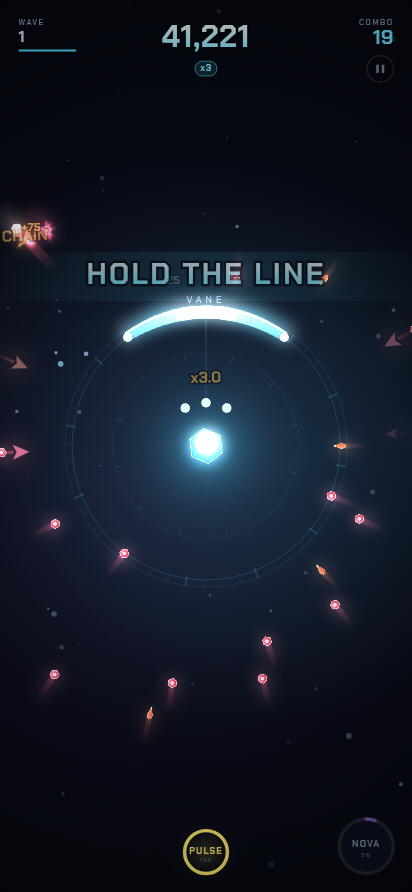
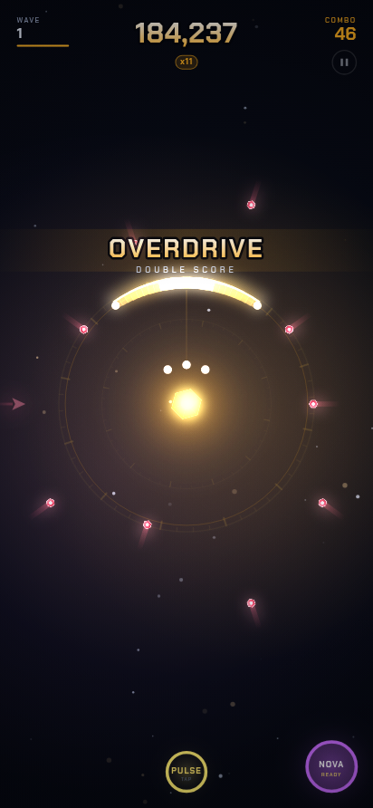
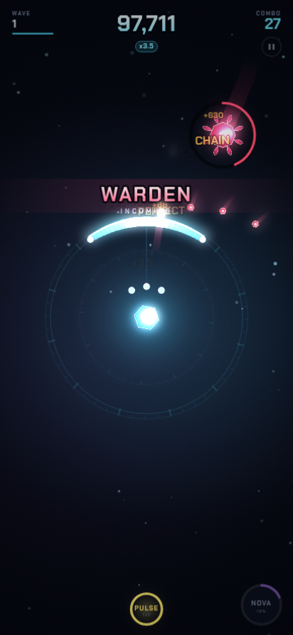
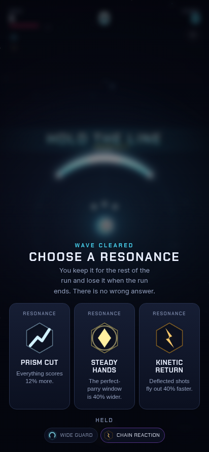

# AEGIS

**One thumb. One shield. Deflect everything.**

A one-thumb ring-defense arcade game with a Guardian collection. You defend a
single point at the centre of the screen. Everything converges on it. Nothing
you block is wasted — it becomes the shot that kills the next one.

Runs last one to two minutes. Then you spend what you earned on the thing the
game is really about: pulling for Guardians.

Every third wave the run stops and offers three upgrades, so no two runs are the
same shape. Everybody plays the same seed on the same day. And when a run turns
into something worth seeing, the game records it and hands you the video.

<p align="center">
  
  
  
  
</p>

```bash
npm install
npm run dev          # http://localhost:5173
```

| Command | What it does |
| --- | --- |
| `npm run dev` | Dev server with hot reload |
| `npm run build` | Type-check, then production build into `dist/` |
| `npm run preview` | Serve the production build |
| `npm test` | 305 unit tests (gacha, combat, draft, economy, quests, clips, textures, engine) |
| `npm run balance` | Headless balance simulation — see [Balance](#balance) |
| `npm run smoke` | Build, serve, and drive the whole game in a real browser |
| `npm run resilience` | Boot the build in seven deliberately broken browsers |
| `npm run atlas:manifest` | Print the texture contract, or diff it against an atlas |
| `npm run typecheck` | `tsc --noEmit` |

Review tooling, all writing screenshots into `tools/shots/`:

| Command | What it does |
| --- | --- |
| `node tools/viewports.mjs` | Every screen at six sizes, failing on any overflow |
| `node tools/capture.mjs` | Set-pieces that are slow to reach by playing |
| `node tools/soak.mjs 180` | Play for three minutes and watch for leaks |
| `node tools/a11y.mjs` | Names, targets, contrast and focus on every screen |
| `node tools/offline.mjs` | Register, cache, cut the network, and play anyway |
| `node tools/icons.mjs` | Regenerate the app icons |
| `node tools/og.mjs` | Re-render the 1200x630 social preview from the live game |

No backend. No accounts. Save data lives in `localStorage` and can be exported
as a code from Settings. Open the game in two tabs and the one that earns
something first keeps the account; the other stops saving and says so, because
a stale tab left open from yesterday must not be able to erase today.

---

## The game

### Two verbs

**AIM** — drag anywhere. A shield arc follows your thumb's angle around the
nexus. Contact anywhere on the arc **blocks**; contact near the arc's centre is
a **PERFECT**, worth double and enough to break armour.

**PULSE** — tap. A ring sweeps out from the nexus. Anything it touches is
**PARRIED**, at any angle. So the shield is a *positioning* tool and the pulse
is a *timing* tool, and catching a cluster at the shield radius is the highest
value play in the game.

Everything you block flies back out and kills what it hits. **Chains** are where
the big scores come from, and why a good defensive turn snowballs.

### The pressure

Seven threat archetypes, each asking a different question. Orbs test coverage,
Lancers test speed, Splitters test the aftermath, Bulwarks cannot be blocked
head-on, Seekers steer toward whichever side you are *not* covering, and
Heralds stop *outside* your shield and shell the nexus from there — the pulse
ring is the only thing that reaches that far, which turns it from a panic button
into a way of touching something out of reach. A Herald always commits after
three shots, so ignoring it is a cost and never a stalemate.

The Warden — the boss on every fifth wave — is armoured, fires its own volleys,
and sheds a ring of orbs when it falls. Below a third of its health it
**enrages**: nearly double the rate of fire, a much wider fan, and faster drift.
A boss whose behaviour never changes is a health bar with a sprite on it, and
the last third of the longest fight in the game should not be its least
interesting.

Combo multiplies everything, up to 12x. At 30 combo you enter **Overdrive** and
the whole arena turns gold at double score. Taking damage breaks the chain — in
Overdrive you keep part of it, because losing a 40-combo to one mistake is how
you make people stop playing.

### The draft

Every third wave the run stops and offers three Resonance cards. Take one, keep
it until you die, lose it when you do.

This is in the game for a specific reason. A Guardian you pulled last week plays
the same way every run, and "the same way every run" is what makes people stop
after five. A draft means the *build* is different even when the Guardian is
not — and a run that went somewhere unexpected is a run worth telling someone
about.

Twenty-four cards across three tiers, weighted so the first draft is almost
always three commons and the fifth is regularly showing epics: a wave-2 player has not
earned a run-defining card and would not know what to do with one. Every card is
large enough to feel inside ten seconds — WIDE GUARD is +18% arc, not +4% — and
at least one costs you something: FOCUS scores 70% more on perfects and narrows
your shield to do it.

The whole thing is a pure fold. A run's modifiers are recomputed from the list
of cards taken, never applied incrementally, so a card can never land twice and
the run's entire state is reproducible from that list.

### The Daily Run

One seed, the same for everyone, changing at local midnight. The wave director
was already deterministic, so this cost almost nothing to build and changes the
conversation entirely: a score out of context is a number, and a score on *the
waves everyone else played today* is an argument.

It is deliberately not a leaderboard. No server, no accounts, no ranking to
defend — a numbered day, your best on it, and share text built so two people can
compare in a reply: `AEGIS Daily #208 — wave 14, 84,233 (3 tries).`

Replaying is allowed, and that is a decision rather than an oversight. Locking
the day after one attempt punishes the player who wants to improve, which is
exactly the player worth keeping. The number that travels is your best of the
day, and the attempt count travels with it so nobody is pretending otherwise.

### Coming back

A seven-day reward track that *advances* rather than resets — missing a day
costs that day's reward and nothing else, because a wiped streak is what turns
a game into an obligation. Alongside it, three daily objectives rolled from
your account id and the date, so they are stable across reloads without a
server and different tomorrow without a scheduler.

Every objective is reachable in a good run, and they point at skills rather
than at time: "land 40 perfects" teaches aiming, "play 20 runs" teaches
nothing and just occupies an evening.

### The collection

Sixteen Guardians across five rarities. Each one changes how the game *feels*,
not just a number: shield arc width, turn speed, parry window, deflection force,
integrity, and one of ten Ultimates. The highest-skill option in the game — a
razor arc that parries wide — sits at Rare on purpose.

---

## Architecture

```
src/
├─ core/       loop, input, RNG, storage, events, maths      (no DOM assumptions)
├─ render/     renderer + bloom, texture store, particles, camera, palette
├─ audio/      synthesis engine, adaptive score, haptics
├─ game/       simulation, wave director, VFX, HUD, coaching  (no DOM at all)
├─ meta/       profile, gacha, IAP scaffolding, share card
├─ ui/         DOM screens over the live arena
├─ data/       every tuning number, in one place
└─ app/        the shell that owns all of it
```

Four boundaries do most of the work:

**Simulation knows nothing about rendering.** `GameSession` has no DOM
dependency at all, which is why the entire combat model can be unit tested at a
fixed timestep and why `npm run balance` can play hundreds of runs in seconds.

**Gameplay emits facts; everything else listens.** Combat does not know that
audio, VFX, quests or analytics exist. It emits `hit`, `parry`, `bossKilled`,
and those systems subscribe. Delete `Vfx.ts` and the game still plays
identically — it just feels dead.

**Every drawn thing resolves a texture key.** See [Sprites](#sprites).

**Every tuning number lives in `data/`.** Balance can be iterated, diffed, and
eventually driven from a remote config without reading a line of logic.

### Rendering

Canvas2D looks flat on its own, so there is a real post chain: emissive shapes
are drawn a second time into a half-resolution buffer, blurred, and composited
back additively for bloom, then the scene is presented with camera shake, a
chromatic split on heavy hits, a vignette and film grain. Quality drops
automatically if the device cannot hold the frame budget.

The HUD is drawn on the canvas rather than in the DOM so it shares the bloom and
the camera shake. A HUD that sits perfectly still while the world shakes reads
immediately as a separate, cheaper layer.

### Audio

Everything is synthesised at runtime — no sample files, so the bundle stays
small and nothing needs licensing. A 16-step sequencer runs on the AudioContext
clock with lookahead scheduling and six layers that fade in with an intensity
value driven by wave, combo and Overdrive.

The single most important detail: **consecutive hits climb a pentatonic
ladder.** A combo is audibly a melody going up, and losing it is audibly a fall.

---

## Sprites

The game ships complete with procedurally generated art, and it is built to have
that art replaced without touching gameplay, UI or VFX code.

**Read [`docs/SPRITES.md`](docs/SPRITES.md) before drawing anything** — it lists
every texture key, its exact frame size, its anchor and its facing.

The short version: every draw call resolves a *key* like `guardian/eclipse/portrait`
or `threat/lancer`. Today those keys are produced by `render/procgen.ts`. Drop a
TexturePacker atlas at `public/assets/atlas.json` and `TextureStore.loadAtlas`
overrides the same keys with real frames at boot. Nothing else changes.

---

## Monetisation

No real money moves in this build. What exists is the *shape* of a real store:
a `PurchaseProvider` interface, an entitlement model, a currency ledger, and a
mock provider that completes instantly, charges nothing, and says so in the UI.
See [`docs/MONETISATION.md`](docs/MONETISATION.md) to connect a real one.

The gacha is implemented honestly, and that is a product decision rather than a
compromise:

- Published rates are read from the same config the roll uses, so the numbers on
  the Rates screen cannot drift from the numbers in the code.
- Soft pity from summon 61, hard pity at 90, an Epic floor every 10 and a
  Legendary floor every 20 — all stated on the Rates screen, alongside a
  *simulated* average cost per Mythic, because "0.7%" alone is technically true
  and practically misleading.
- The RNG stream is persisted and advanced, so a pull cannot be re-rolled by
  reloading, and any result can be reproduced from its recorded state.
- Rates never vary by spend, session length or account age.
- Duplicates always convert to Shards and star progress. No summon is ever worth
  nothing.
- Nothing purchasable changes summon rates or gates gameplay content.

---

## Balance

`npm run balance` plays hundreds of headless runs with a scripted bot at three
skill levels and reports the wave distribution, run lengths, an economy
projection, and a per-Guardian comparison.

```
npm run balance                          # all three skill levels
npm run balance -- --runs 400 --roster   # deeper, plus the Guardian table
npm run balance -- --skill expert
```

Current shape:

| Skill | Median wave | Median run | Met a Warden |
| --- | --- | --- | --- |
| novice | 9 | 63s | 96% |
| average | 16 | 120s | 100% |
| expert | 24 | 180s | 100% |

An average run earns ~655 Cores, which is a summon every three runs and a
ten-pull every twenty-nine. The core and XP rates were halved when the draft
landed: it roughly doubled the score an average run puts up — that is the point
of it — and leaving them alone would have quietly halved the price of
everything.

`--roster` reports every Guardian's median run side by side, and the median by
rarity underneath it:

| Rarity | Median score |
| --- | --- |
| common | 515k |
| rare | 635k |
| epic | 957k |
| legendary | 2.47M |
| mythic | 2.59M |

The curve has to be monotonic. A raw best-to-worst ratio is the wrong alarm on
its own — rarity is *supposed* to matter, so a healthy roster spreads wide — but
a tier that earns less than the tier below it is a pull the player is
disappointed by, and that is the one outcome a gacha cannot afford. The harness
warns on the inversion, not on the spread.

The harness has already earned its place, three times. Its first report showed a
median run length equal to the harness cap — runs were not ending at all — which
turned out to be two independent soft-locks and one Ultimate that recharged
itself. Its roster comparison later showed one Guardian's *median* run sitting at
the ten-minute cap, still alive at wave 62 while the next best in the roster
reached 26: SIPHON healed faster than the game could damage, so the run had no
ending. And with that fixed it showed an epic earning less than three commons,
which is a pull nobody wants to get.

---

## Accessibility

Screen shake, full-screen flashes and chromatic aberration are exactly the
effects that make this game feel good and exactly the effects that make some
people unable to play it, so they are the *first* settings, not the last:
shake is a 0-100% slider, flashes and chromatic split can be reduced, and the
HUD mirrors for left-handed play.

`prefers-reduced-motion` is honoured on both sides of the canvas boundary: CSS
stills the interface, and a new save seeds its shake and flash settings from the
same preference. The DOM half was easy and the canvas half is the part the
setting is actually about — the screen shake, the full-screen flashes and the
chromatic split all live there. It seeds a default rather than overriding a
choice, so a player who turns the shake back up keeps it.

The whole game is playable with a keyboard: `A`/`D` or arrows to aim, `Space` to
pulse, `Shift`/`Q` for the Ultimate, `Esc` to pause. Every control shows where
focus is — the menus are real DOM rather than canvas precisely so that focus
order, screen readers and keyboard navigation work.

`node tools/a11y.mjs` walks every screen and fails on a control with no
accessible name, a target too small to hit with a thumb, text below the contrast
floor, or an element that takes focus and shows nothing. It has already paid for
itself: the label colour every screen uses sat at 3.4:1 against its own panel,
under the 4.5:1 floor for text that size, and several `transition: all` rules
were animating the focus outline — so a keyboard player waited 200ms to find out
where they were.

---

## Testing

- **305 unit tests** across gacha guarantees, combat mechanics, the Resonance
  draft, the wallet and save migration, daily objectives, clip capture
  decisions, the texture contract, and the engine primitives. The gacha suite
  asserts every published guarantee, including the 50/50 and its make-good; the
  quest suite asserts a reward can never pay twice; the draft suite asserts
  every card changes something and none of them can be applied twice.
- **Nothing declared may be decorative.** `tests/live-stats.test.ts` builds two
  sessions that differ in exactly one value — a Guardian stat, a draft modifier,
  an Ultimate, a threat property — drives an identical scenario, and asserts
  something a player could see comes out different. A stat with no probe fails
  the suite, so the next one added has to be wired up before it can ship. This
  file exists because `parryWindow` was printed on every Guardian card, scaled
  by level and stars, multiplied by a Resonance card, and read by no code at
  all.
- **`npm run balance`** for systemic behaviour over hundreds of runs, drafting
  as it plays so its numbers describe the game as it is actually played rather
  than a version nobody sees.
- **`npm run smoke`** drives a real Chromium at phone size: claims the daily
  reward, plays a run with an autopilot, checks the pause menu actually freezes
  the world, drafts a Resonance, records a highlight clip and checks the encoder
  actually produced a file, plays the Daily Run and checks it is recorded and
  rewarded, performs a ten-pull, opens every screen,
  renders the share card, follows a challenge link and checks the run uses the
  challenger's seed. Fails on any console error.
- **`node tools/viewports.mjs`** opens every screen from a 320px phone to a 21:9
  monitor and fails on content wider than the viewport — and resizes the window
  mid-run to check nothing in flight is stranded inside the shield by it.
- **`node tools/soak.mjs [seconds]`** plays continuously for several minutes —
  through escalation, boss fights, drafts, deaths and restarts — sampling heap,
  texture cache, live entities and frame rate, and fails on a leak or on a game
  where runs cannot end. Thirty seconds of smoke test cannot prove the game
  survives an evening.
- **`node tools/offline.mjs`** registers the worker the way a first visit does,
  cuts the network, reloads and starts a run — because "works offline" is
  exactly the kind of promise that quietly stops being true.
- **`node tools/a11y.mjs`** walks every screen and fails on a control with no
  accessible name, a target too small for a thumb, text under the contrast
  floor, or an element that takes focus and shows nothing.
- **`node tools/resilience.mjs`** boots the build in browsers that are broken the
  way real players' browsers are broken — localStorage throwing on every call,
  a corrupt save, a save from a newer build, a save whose fields are the wrong
  type entirely, no `AudioContext`, no `MediaRecorder`, no `captureStream` — and
  fails unless the game still starts and still plays. Losing a feature is fine;
  losing the game is not.

---

## Sharing

Three things travel, and they are deliberately different shapes: a **clip** is
what gets watched, a **challenge link** is what turns a viewer into a player,
and the **Daily Run** is what makes two scores comparable in the first place.

### The highlight clip

A screenshot proves a score. Nobody watches a screenshot. When a run turns into
something worth seeing — the last life, a Warden on screen, a combo past 25 —
the game starts recording, and the results screen offers the last stretch back
as a real video file with the game's own audio on it, one tap from the share
sheet.

Three things make it work rather than just exist:

- **MP4 first.** Instagram and TikTok will not ingest WebM. The recorder asks
  for MP4 wherever the browser can encode it and says plainly when it cannot.
- **It refuses to cost frames.** Frames are copied into a capture canvas capped
  at 1280px and pushed at 30fps rather than encoding the display surface at
  device pixel ratio. If the frame rate still drops to 72% of what the run was
  holding before the recorder armed, the clip is abandoned mid-encode. A smooth
  game matters more than a clip of one.
- **It carries a mark.** The wordmark is drawn into the frames, small and in the
  corner. A clip that travels without naming the game does nothing for it.

The recorder keeps at most two rolling segments, so a twenty-minute run costs
the same memory as a two-minute one, and the segment containing the ending is
the one that gets offered.

### Challenge links

A run is reproducible: the wave director is seeded, so the same seed produces
the same waves in the same order. Sharing emits both a card and a **challenge
link** carrying that seed and the score to beat. Opening the link lands on a
challenge screen with one button, and the HUD then shows the target with a bar
that fills as you close on it.

The token is deliberately tiny and unsigned. It is a party trick, not a
leaderboard — anyone can hand-craft one, which costs nothing because there is no
ranking to corrupt.

What *is* taken seriously is that this is the one input a stranger controls end
to end, and often the first thing a new player ever loads. Decoding clamps or
resolves every field rather than trusting it: a token naming a Guardian that
does not exist used to throw during boot and leave a blank screen, which is the
worst possible outcome for the one feature whose whole job is being opened by
somebody who has never played.

The game is also installable: web manifest, service worker, offline play, and a
generated icon set. Navigations are network-first so a deploy reaches players;
hashed assets are cache-first because the URL is immutable, and the worker reads
the shell at install time to precache whatever bundles the current build
references — it does not control the page on the visit that registers it, so
without that the first visit cached nothing worth having.

`node tools/offline.mjs` cuts the network and plays anyway, because "works
offline" is exactly the kind of promise that quietly stops being true. It has
already caught two separate reasons it was not: the worker was never registered
at all, because the registration was attached to a `load` event that had already
fired by the time boot finished, and every cache lookup missed because entries
added by URL carry a different `Accept` header than the page's own requests.

---

## Deploying

`.github/workflows/deploy.yml` publishes `dist/` to GitHub Pages on every push
to `main`, running the same type-check, tests and build that CI runs — a green
CI is a deployable artefact by construction. Enable it once under **Settings →
Pages → Source → GitHub Actions**; nothing else needs configuring, because
every URL the game emits is relative (`base: './'`, manifest `scope: './'`), so
it runs from a project subpath exactly as it does from a domain root.

Any static host works the same way: `npx vite build` and serve `dist/`.

---

## Status

Complete and playable end to end: gameplay, progression, collection, summoning,
shop, daily loop, daily run, objectives, the in-run draft, coaching, challenge
links, share card, highlight clips, audio, settings, save transfer and offline
install.

Not built yet, and deliberately: a backend, leaderboards, real payments, and the
sprite art itself.

Everything the game claims about itself is checked by something that runs: the
published gacha rates by the test suite, the balance by a headless harness that
plays hundreds of runs, the layout at six screen sizes, offline play by cutting
the network, accessibility on every screen, and the whole thing booting in seven
deliberately broken browsers. That is the point of the tooling in `tools/` — a
promise nobody verifies is a promise that quietly stops being true, and several
of these had already stopped.
